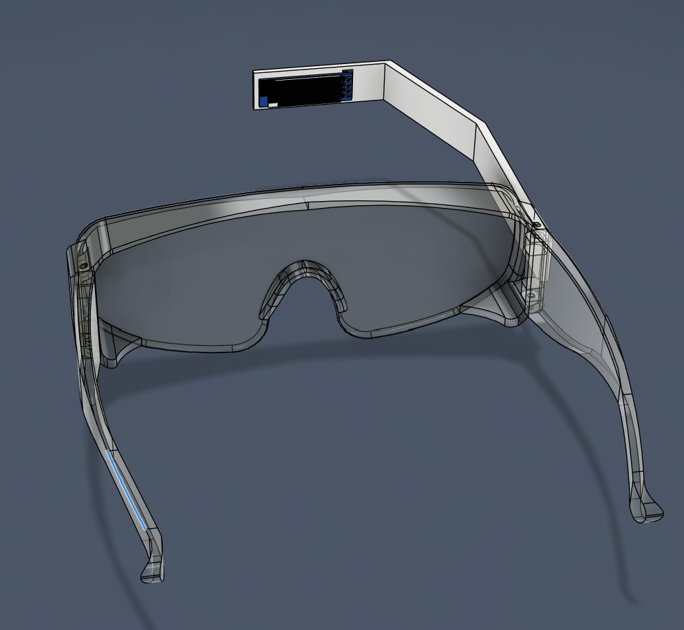

# SMG -> Shitty Meta Glasses
Have you ever been lost in a conversation? Trying to keep up with all the lingo and jargon? Shitty Meta Glasses is here to help. Packaged with John Blockchain himself, you'll find a convenient package that listens to your conversation and tells you what to say in response. Provide bullshit answers with confidence, for you will become a 10X networker immediately.

# IRL

# Infrastructure

Okay so basically we needed to communicate between our phone and the esp32, as we didnt have a mic on hand and needed to use the phone mic. We ended up using a Flask server. This worked fine on localhost, but when connecting via phone, we needed https to allow the speech recognition to work. We couldn't really set up our own certificate, so we used ngrok to tunnel our local connection and make https available for our phone.

Tbh this was more software than hardware. Still fun though.

# CAD

# Wiring Schematic

# Bill of Materials
| Part                        | Quantity |
|-----------------------------|----------|
| Safety Glasses              | 1        |
| Lolin Esp32 MCU             | 1        |
| 128x32 0.91" OLED Display   | 1        |
| Large Push Button           | 1        |
| Dupont jumpers              | 15       |
| USB-C Cable                 | 1        |